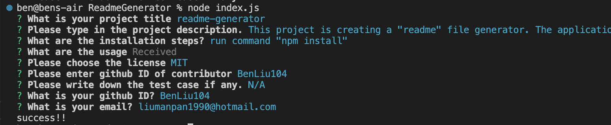

# readme-generator

## Description
This project is creating a "readme" file generator. The application will run on node.js

## Table of Contents
- [Installation](#installation)
- [Usage](#usage)
- [Credits](#credits)
- [License](#license)
- [Tests](#tests)
- [Questions](#questions)

## Installation
Run command "npm install"

## Usage
1.Run command "node index.js"

2.Answer the question by following the instruction

3.Readme file with file name "project-name.md" will be generated.

please refer to the video for demo:
https://youtu.be/BlpHwbnTugM

## Credits

BenLiu104 : https://github.com/BenLiu104

## License

License - MIT

## Tests

N/A

## Questions
If there is any question, plesae find more information on my github
BenLiu104 : https://github.com/BenLiu104

or contact me by email : liumanpan1990@hotmail.com
